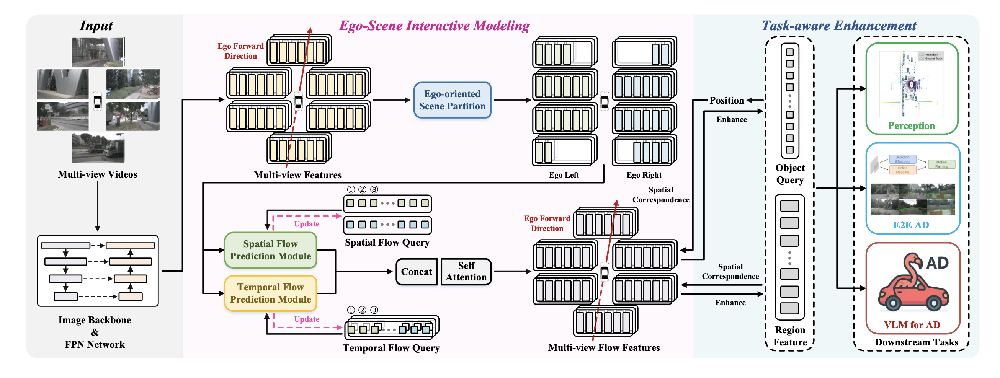

<div align="center">

# FlowAD: Ego-Scene Interactive Modeling for Autonomous Driving

[](https://openreview.net/pdf?id=m4JpoJRgAr)
[](https://openreview.net/pdf?id=m4JpoJRgAr)

</div>

## Introduction

This repository contains the official implementation of **FlowAD**, a novel ego-scene interactive modeling framework for autonomous driving. Unlike traditional approaches that treat each timestamp in isolation, FlowAD explicitly models the **feedback of ego-vehicle motion** to future observations, fundamentally improving the understanding of the driving process and enhancing planning capabilities.

 
*The architecture of our FlowAD structured around three core components: 1) Ego-guided scene partition. 2) Spatial and temporal flow prediction. 3) Task-aware enhancement.*

Inspired by human perception, FlowAD represents ego-scene interaction as **scene flow relative to the ego-vehicle**, capturing relative motion as learnable scene flow within the latent feature space. This enables modeling ego-motion feedback using existing log-replay datasets without requiring complex scenario simulations.

**Key Achievements:**
- **19% collision rate reduction** over SparseDrive on nuScenes
- **60% FCP improvement** (1.39 frames) on nuScenes validation set  
- **51.77 driving score** on Bench2Drive closed-loop evaluation
- Demonstrated generality across **perception, end-to-end planning, and VLM analysis**


## Project Structure

This repository contains four sub-projects, each applying the flow method to a different base model:

| Project | Base Model | Task | Description |
|---------|------------|------|-------------|
| [Senna-Flow](./Senna-Flow/) | [Senna](https://github.com/hustvl/Senna) | VLM-based Driving | Flow-enhanced vision-language model for end-to-end autonomous driving |
| [SparseBEV-Flow](./SparseBEV-Flow/) | [SparseBEV](https://github.com/MCG-NJU/SparseBEV) | 3D Object Detection | Flow-enhanced sparse BEV detection |
| [SparseDrive-Flow](./SparseDrive-Flow/) | [SparseDrive](https://github.com/swc-17/SparseDrive) | End-to-End Driving | Flow-enhanced sparse scene representation for planning |
| [SparseOcc-Flow](./SparseOcc-Flow/) | [SparseOcc](https://github.com/MCG-NJU/SparseOcc) | Occupancy Prediction | Flow-enhanced sparse occupancy prediction |

## Getting Started

### Prerequisites

Each sub-project has its own environment requirements. Please refer to the individual README files for detailed setup instructions.

### Quick Start

1. Clone this repository:
```bash
git clone https://github.com/your-repo/FlowAD.git
cd FlowAD
```

2. Navigate to the desired sub-project:
```bash
cd SparseBEV-Flow  # or Senna-Flow, SparseDrive-Flow, SparseOcc-Flow
```

3. Follow the sub-project's README for environment setup and training/evaluation.

## Performance Highlights

### nuScenes Open-Loop Evaluation

Our method achieves significant improvements across multiple tasks:

| Method | Backbone | Detection |  | Tracking |  | Motion Prediction |  | Planning |  | FCP↓ |
|--------|----------|-----------|--|----------|--|-------------------|--|----------|--|------|
|        |          | mAP↑ | NDS↑ | AMOTA↑ | AMOTP↓ | minADE↓ | minFDE↓ | Avg.L2 (m)↓ | Avg.Col↓ |  |
| UniAD  | ResNet101 | 0.380 | 0.498 | 0.359 | 1.320 | 0.71 | 1.02 | 0.69 | 0.12 | 2.96 |
| SparseDrive | ResNet101 | 0.496 | 0.588 | 0.501 | 1.085 | 0.60 | 0.96 | 0.58 | 0.06 | 2.30 |
| **FlowAD (Ours)** | **ResNet101** | **0.523** | **0.605** | **0.518** | **1.040** | **0.56** | **0.93** | **0.52** | **0.05** | **0.91** |

*FCP (Frames before Correct Planning): Lower is better. FlowAD achieves 1.39 frames improvement (48% reduction) over SparseDrive and 2.03 frames improvement (60% reduction) over baseline methods.*

### Qualitative Results - Perception

<!-- TODO: Add perception visualization here -->
 
*FlowAD demonstrates superior detection of occluded objects, small targets, and dense scenes through learned scene flow dynamics.*

### Bench2Drive Closed-Loop Evaluation


*FlowAD achieves **51.77 driving score**, demonstrating robust closed-loop performance.*


## Citation

If you find this work useful in your research, please consider citing:

```bibtex
@inproceedings{FlowAD2026,
  title={FlowAD: Ego-Scene Interactive Modeling for Autonomous Driving},
  author={Anonymous},
  booktitle={Under review as a conference paper at ICLR 2026},
  year={2026},
  url={https://openreview.net/pdf?id=m4JpoJRgAr}
}
```

## Acknowledgements

This work builds upon several excellent open-source projects:

- [Senna](https://github.com/hustvl/Senna) - VLM-based autonomous driving
- [SparseBEV](https://github.com/MCG-NJU/SparseBEV) - Sparse 3D object detection
- [SparseDrive](https://github.com/swc-17/SparseDrive) - End-to-end autonomous driving
- [SparseOcc](https://github.com/MCG-NJU/SparseOcc) - Sparse occupancy prediction

## License

This project is released under the Apache 2.0 license. Please see the LICENSE files in each sub-project for more details.
