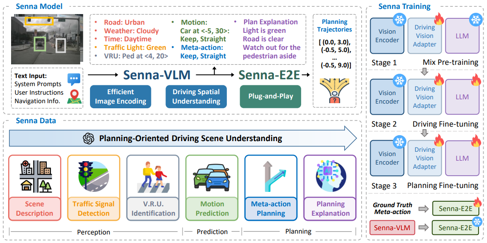
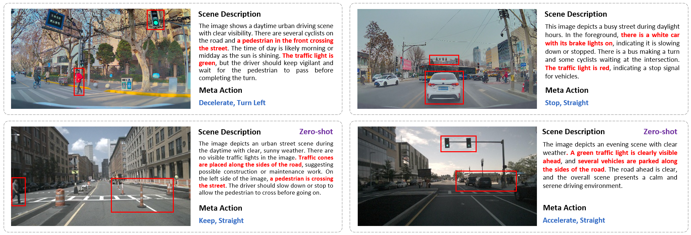

<div align="center">


# Senna-Flow

</div>

This project extends [Senna](https://github.com/hustvl/Senna) with our flow-based world model for enhanced vision-language model based autonomous driving.

> **Note**: For paper information and citation, please refer to the [main README](../README.md).

<div align="center">

</div>

## Flow Method Extension

This repository adds flow-based feature enhancement to the original Senna model, improving the integration between the Large Vision-Language Model and end-to-end autonomous driving.

### Flow-specific Files

- **Models**: `llava/senna/senna_llava_arch_flow.py`, `llava/senna/senna_llava_llama_flow.py`, `llava/senna/world_model_hd2.py`
- **Training**: `llava/senna/train_senna_llava_multi_img.py`

### Key Features

- Flow-enhanced visual feature aggregation across multi-view cameras
- World model integration for improved temporal understanding
- Compatible with the original Senna training pipeline

## Highlights

* Senna is an autonomous driving system that integrates a Large Vision-Language Model with an end-to-end model to improve planning safety, robustness and generalization.
* Senna-Flow enhances this with flow-based temporal feature aggregation.

## Getting Started

### Installation

```bash
git clone https://github.com/your-repo/UAD-Flow.git
cd UAD-Flow/Senna-Flow
conda create -n senna python=3.10 -y
conda activate senna
pip install -r requirements.txt
```

### Data Preparation

We provide a script for generating QA data required for Senna training. The script uses [LLaVA-v1.6-34b](https://huggingface.co/liuhaotian/llava-v1.6-34b) as the model for generating scene descriptions and planning explanations:

```bash
bash data_tools/senna_nusc_converter.sh
```

### Weights

| Method | Model Size | Base LLM | Input View | Token per Image | Download |
| :---: | :---: | :---: | :---: |  :---: | :---: |
| Senna | 7B | vicuna-7b-v1.5 | 6 View | 128 | [Hugging Face](https://huggingface.co/rb93dett/Senna) |

### Training

For Stage-1 Mix Pre-training:
```bash
bash train_tools/pretrain_senna_llava.sh
```

For Stage-2 Driving Fine-tuning and Stage-3 Planning Fine-tuning (full-parameter fine-tuning):
```bash
bash train_tools/train_senna_llava.sh
```

For Stage-2 Driving Fine-tuning and Stage-3 Planning Fine-tuning (LoRA fine-tuning):
```bash
bash train_tools/train_senna_llava_lora.sh
```

In our experiments, we observed that full-parameter fine-tuning outperforms LoRA fine-tuning. However, if your machine has limited GPU memory (e.g., only 24GB), you may consider using LoRA fine-tuning as an alternative.

### Evaluation

You can evaluate the accuracy of Senna meta-action planning using the script below:
```bash
bash eval_tools/senna_plan_cmd_eval_multi_img.sh
```

### Visualization

By running the visualization script below, you can overlay the predicted meta-actions and front-view scene descriptions onto the front-view image:
```bash
bash eval_tools/senna_plan_visualization.sh
```

## Qualitative Results

<div align="center">

</div>

## Acknowledgements

This project is based on [Senna](https://github.com/hustvl/Senna) and [LLaVA](https://github.com/haotian-liu/LLaVA). Thanks to the original authors for their excellent work.

## Related Projects

[VAD & VADv2](https://github.com/hustvl/VAD), [MapTR](https://github.com/hustvl/MapTR)
