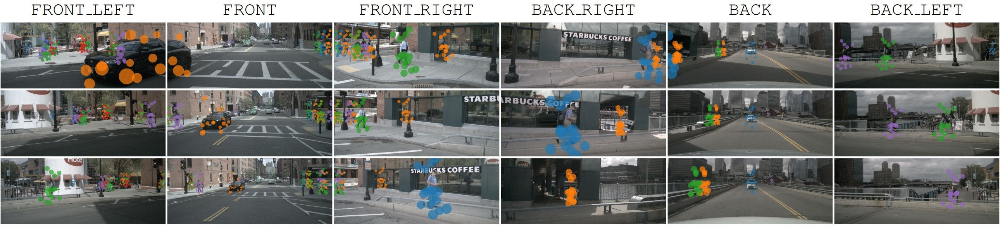

# SparseBEV-Flow

This project extends [SparseBEV](https://github.com/MCG-NJU/SparseBEV) with our flow-based world model for enhanced 3D object detection.

> **Note**: For paper information and citation, please refer to the [main README](../README.md).



## Flow Method Extension

This repository adds flow-based feature enhancement to the original SparseBEV model. The flow method aggregates features from adjacent camera views to improve temporal understanding.

### Flow-specific Files

- **Models**: `models/sparsebev_head_flow*.py`, `models/sparsebev_transformer_flow.py`
- **Configs**: `configs/r50_nuimg_704x256_flow*.py`
- **Training Scripts**: `dist_train_sparsebev_flow*.sh`

### Flow Parameters

| Parameter | Description | Default |
|-----------|-------------|---------|
| `flow_patches` | Patch sizes for multi-scale flow extraction | `[8, 4, 2, 1]` |
| `flow_ids` | Feature level indices for flow processing | `[0, 1, 2, 3]` |

### Recommended Flow Config

For best results, use the following config:
- `configs/r50_nuimg_704x256_flow_attn_wm_mlfuse_ego_pe_spatial_final_forward.py`

## Model Zoo

| Setting  | Pretrain | Training Cost | NDS<sub>val</sub> | NDS<sub>test</sub> | FPS | Weights |
|----------|:--------:|:-------------:|:-----------------:|:------------------:|:---:|:-------:|
| [r50_nuimg_704x256](configs/r50_nuimg_704x256.py) | [nuImg](https://download.openmmlab.com/mmdetection3d/v0.1.0_models/nuimages_semseg/cascade_mask_rcnn_r50_fpn_coco-20e_20e_nuim/cascade_mask_rcnn_r50_fpn_coco-20e_20e_nuim_20201009_124951-40963960.pth) | 21h (8x2080Ti) | 55.6 | - | 15.8 | [gdrive](https://drive.google.com/file/d/1ft34-pxLpHGo2Aw-jowEtCxyXcqszHNn/view) |
| [r50_nuimg_704x256_400q_36ep](configs/r50_nuimg_704x256_400q_36ep.py) | [nuImg](https://download.openmmlab.com/mmdetection3d/v0.1.0_models/nuimages_semseg/cascade_mask_rcnn_r50_fpn_coco-20e_20e_nuim/cascade_mask_rcnn_r50_fpn_coco-20e_20e_nuim_20201009_124951-40963960.pth) | 28h (8x2080Ti) | 55.8 | - | 23.5 | [gdrive](https://drive.google.com/file/d/1C_Vn3iiSnSW1Dw1r0DkjJMwvHC5Y3zTN/view) |

* We recommend using `r50_nuimg_704x256` to validate new ideas since it trains faster and the result is more stable.
* FPS is measured with AMD 5800X CPU and RTX 3090 GPU (without `fp16`).

## Environment

Install PyTorch 2.0 + CUDA 11.8:

```bash
conda create -n sparsebev python=3.8
conda activate sparsebev
conda install pytorch==2.0.0 torchvision==0.15.0 pytorch-cuda=11.8 -c pytorch -c nvidia
```

or PyTorch 1.10.2 + CUDA 10.2 for older GPUs:

```bash
conda create -n sparsebev python=3.8
conda activate sparsebev
conda install pytorch==1.10.2 torchvision==0.11.3 cudatoolkit=10.2 -c pytorch
```

Install other dependencies:

```bash
pip install openmim
mim install mmcv-full==1.6.0
mim install mmdet==2.28.2
mim install mmsegmentation==0.30.0
mim install mmdet3d==1.0.0rc6
pip install setuptools==59.5.0
pip install numpy==1.23.5
```

Install turbojpeg and pillow-simd to speed up data loading (optional but important):

```bash
sudo apt-get update
sudo apt-get install -y libturbojpeg
pip install pyturbojpeg
pip uninstall pillow
pip install pillow-simd==9.0.0.post1
```

Compile CUDA extensions:

```bash
cd models/csrc
python setup.py build_ext --inplace
```

## Prepare Dataset

1. Download nuScenes from [https://www.nuscenes.org/nuscenes](https://www.nuscenes.org/nuscenes) and put it in `data/nuscenes`.
2. Download the generated info file from [Google Drive](https://drive.google.com/file/d/1uyoUuSRIVScrm_CUpge6V_UzwDT61ODO/view?usp=sharing) and unzip it.
3. Folder structure:

```
data/nuscenes
├── maps
├── nuscenes_infos_test_sweep.pkl
├── nuscenes_infos_train_sweep.pkl
├── nuscenes_infos_train_mini_sweep.pkl
├── nuscenes_infos_val_sweep.pkl
├── nuscenes_infos_val_mini_sweep.pkl
├── samples
├── sweeps
├── v1.0-test
└── v1.0-trainval
```

These `*.pkl` files can also be generated with our script: `gen_sweep_info.py`.

## Training

Download pretrained weights and put it in directory `pretrain/`:

```
pretrain
├── cascade_mask_rcnn_r101_fpn_1x_nuim_20201024_134804-45215b1e.pth
├── cascade_mask_rcnn_r50_fpn_coco-20e_20e_nuim_20201009_124951-40963960.pth
```

### Train Original SparseBEV

Train SparseBEV with 8 GPUs:

```bash
torchrun --nproc_per_node 8 train.py --config configs/r50_nuimg_704x256.py
```

### Train SparseBEV-Flow

Train SparseBEV with flow enhancement:

```bash
# Basic flow config
torchrun --nproc_per_node 8 train.py --config configs/r50_nuimg_704x256_flow.py

# Recommended: Full flow config with world model
torchrun --nproc_per_node 8 train.py --config configs/r50_nuimg_704x256_flow_attn_wm_mlfuse_ego_pe_spatial_final_forward.py
```

Or use the provided shell scripts:

```bash
bash dist_train_sparsebev_flow.sh
bash dist_train_sparsebev_flow_attn_wm_mlfuse_ego_pe_spatial_final_forward_r1012.sh
```

The batch size for each GPU will be scaled automatically.

## Evaluation

Single-GPU evaluation:

```bash
export CUDA_VISIBLE_DEVICES=0
python val.py --config configs/r50_nuimg_704x256_flow.py --weights checkpoints/your_model.pth
```

Multi-GPU evaluation:

```bash
export CUDA_VISIBLE_DEVICES=0,1,2,3,4,5,6,7
torchrun --nproc_per_node 8 val.py --config configs/r50_nuimg_704x256_flow.py --weights checkpoints/your_model.pth
```

## Timing

FPS is measured with a single GPU:

```bash
export CUDA_VISIBLE_DEVICES=0
python timing.py --config configs/r50_nuimg_704x256_flow.py --weights checkpoints/your_model.pth
```

## Visualization

Visualize the predicted bbox:

```bash
python viz_bbox_predictions.py --config configs/r50_nuimg_704x256_flow.py --weights checkpoints/your_model.pth
```

Visualize the sampling points:

```bash
python viz_sample_points.py --config configs/r50_nuimg_704x256_flow.py --weights checkpoints/your_model.pth
```

## Acknowledgements

This project is based on [SparseBEV](https://github.com/MCG-NJU/SparseBEV). Thanks to the original authors for their excellent work.

Additional references:
* 3D Detection: [DETR3D](https://github.com/WangYueFt/detr3d), [PETR](https://github.com/megvii-research/PETR), [BEVFormer](https://github.com/fundamentalvision/BEVFormer), [BEVDet](https://github.com/HuangJunJie2017/BEVDet), [StreamPETR](https://github.com/exiawsh/StreamPETR)
* 2D Detection: [AdaMixer](https://github.com/MCG-NJU/AdaMixer), [DN-DETR](https://github.com/IDEA-Research/DN-DETR)
* Codebase: [MMDetection3D](https://github.com/open-mmlab/mmdetection3d), [CamLiFlow](https://github.com/MCG-NJU/CamLiFlow)
