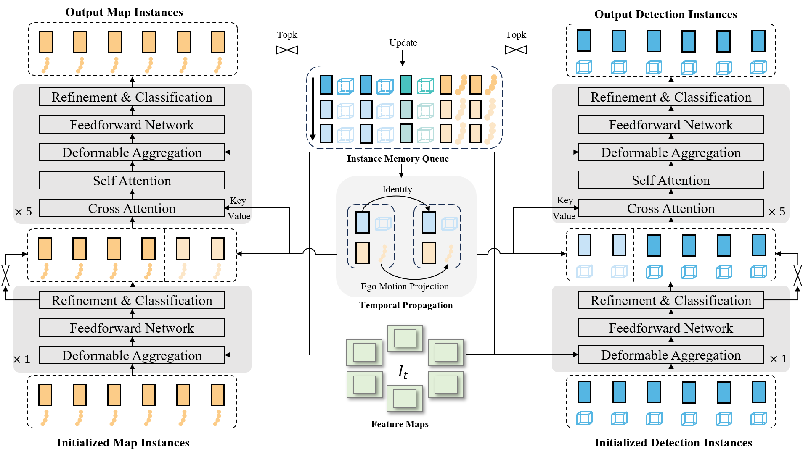

# SparseDrive-Flow

This project extends [SparseDrive](https://github.com/swc-17/SparseDrive) with our flow-based world model for enhanced end-to-end autonomous driving.

> **Note**: For paper information and citation, please refer to the [main README](../README.md).

<center>
    
</center>

## Flow Method Extension

This repository adds flow-based feature enhancement to the original SparseDrive model for improved motion prediction and planning.

### Flow-specific Files

- **Models**: `projects/mmdet3d_plugin/models/sparsedrive_flow*.py`
- **Configs**: `projects/configs/sparsedrive_*_flow*.py`
- **Training Scripts**: `scripts/train_flow*.sh`

### Flow Parameters

| Parameter | Description | Default |
|-----------|-------------|---------|
| `flow_patches` | Patch sizes for multi-scale flow extraction | `[8, 4, 2, 1]` |
| `flow_ids` | Feature level indices for flow processing | `[0, 1, 2, 3]` |

### Recommended Flow Config

For best results, use the following configs:
- Stage 1: `projects/configs/sparsedrive_small_stage1_flow_attn_wm_mlfuse_ego_pe_spatial.py`
- Stage 2: `projects/configs/sparsedrive_small_stage2_flow_attn_wm_mlfuse_ego_pe_spatial.py`

## Introduction

SparseDrive-Flow is a Sparse-Centric paradigm for end-to-end autonomous driving enhanced with flow-based world models:
- Sparse scene representation for efficient perception
- Flow-enhanced temporal feature aggregation
- Parallel motion prediction and planning
- Hierarchical planning selection with collision-aware rescore

<center>
    
    <br>
    <div>Symmetric sparse perception architecture</div>
</center>

<center>
    
    <br>
    <div>Parallel motion planner structure</div>
</center>

## Results

| Method | NDS | AMOTA | minADE (m) | L2 (m) Avg | Col. (%) Avg |
| :---: | :---:| :---: | :---: | :---: | :---: |
| SparseDrive-S | 0.525 | 0.386 | 0.62 | 0.61 | 0.08 |
| SparseDrive-B | 0.588 | 0.501 | 0.60 | 0.58 | 0.06 |

## Quick Start

Please refer to [docs/quick_start.md](docs/quick_start.md) for detailed setup instructions.

### Environment Setup

```bash
# Create conda environment
conda create -n sparsedrive python=3.8
conda activate sparsedrive

# Install PyTorch
conda install pytorch==2.0.0 torchvision==0.15.0 pytorch-cuda=11.8 -c pytorch -c nvidia

# Install dependencies
pip install -r requirement.txt

# Install mmdet3d and other packages
pip install openmim
mim install mmcv-full==1.6.0
mim install mmdet==2.28.2
mim install mmsegmentation==0.30.0
mim install mmdet3d==1.0.0rc6
```

### Training

#### Train Original SparseDrive

```bash
# Stage 1
bash scripts/train.sh projects/configs/sparsedrive_small_stage1.py 8

# Stage 2
bash scripts/train.sh projects/configs/sparsedrive_small_stage2.py 8
```

#### Train SparseDrive-Flow

```bash
# Stage 1 with flow
bash scripts/train_flow_attn_wm_mlfuse_ego_pe_spatial_s1.sh

# Stage 2 with flow
bash scripts/train_flow_attn_wm_mlfuse_ego_pe_spatial_s2.sh
```

### Evaluation

```bash
bash scripts/test_flow.sh projects/configs/sparsedrive_small_stage2_flow_attn_wm_mlfuse_ego_pe_spatial.py checkpoints/your_model.pth 8
```

## Acknowledgement

This project is based on [SparseDrive](https://github.com/swc-17/SparseDrive). Thanks to the original authors for their excellent work.

Additional references:
- [Sparse4D](https://github.com/HorizonRobotics/Sparse4D)
- [UniAD](https://github.com/OpenDriveLab/UniAD) 
- [VAD](https://github.com/hustvl/VAD)
- [StreamPETR](https://github.com/exiawsh/StreamPETR)
- [StreamMapNet](https://github.com/yuantianyuan01/StreamMapNet)
- [mmdet3d](https://github.com/open-mmlab/mmdetection3d)
