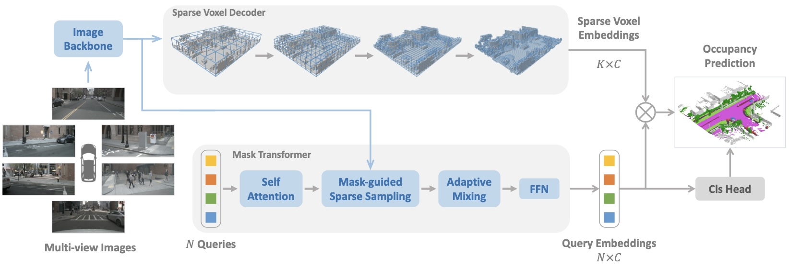
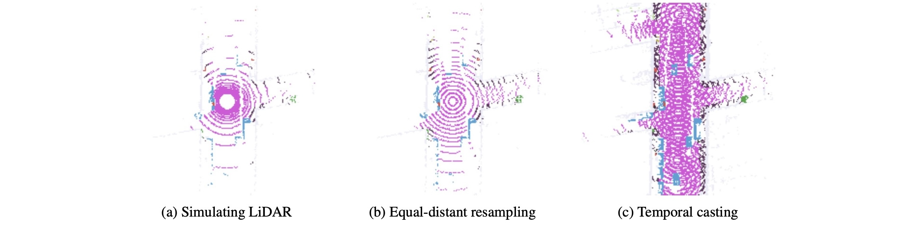

# SparseOcc-Flow

This project extends [SparseOcc](https://github.com/MCG-NJU/SparseOcc) with our flow-based world model for enhanced 3D occupancy prediction.

> **Note**: For paper information and citation, please refer to the [main README](../README.md).

## Flow Method Extension

This repository adds flow-based feature enhancement to the original SparseOcc model for improved sparse occupancy prediction.

### Flow-specific Files

- **Models**: `models/sparseocc_head_flow.py`, `models/world_model_hd2.py`
- **Configs**: `configs/r50_nuimg_704x256_8f_flow.py`
- **Training Scripts**: `dist_train_flow.sh`, `dist_test_flow.sh`

### Flow Parameters

| Parameter | Description | Default |
|-----------|-------------|---------|
| `flow_patches` | Patch sizes for multi-scale flow extraction | `[8, 4, 2, 1]` |
| `flow_ids` | Feature level indices for flow processing | `[0, 1, 2, 3]` |

## Highlights

**SparseOcc** initially reconstructs a sparse 3D representation from visual inputs and subsequently predicts semantic/instance occupancy from the 3D sparse representation by sparse queries.



**RayIoU Evaluation Metric**: A ray-based evaluation metric to solve the inconsistency penalty along depths raised in traditional voxel-level mIoU criteria.



## Model Zoo

| Setting  | Epochs | Training Cost | RayIoU | RayPQ | FPS | Weights |
|----------|:--------:|:-------------:|:------:|:-----:|:---:|:-------:|
| [r50_nuimg_704x256_8f](configs/r50_nuimg_704x256_8f.py) | 24 | 15h, ~12GB | 36.8 | - | 17.3 | [github](https://github.com/MCG-NJU/SparseOcc/releases/download/v1.1/sparseocc_r50_nuimg_704x256_8f_24e_v1.1.pth) |
| [r50_nuimg_704x256_8f_60e](configs/r50_nuimg_704x256_8f_60e.py) | 60 | 37h, ~12GB | 37.7 | - | 17.3 | [github](https://github.com/MCG-NJU/SparseOcc/releases/download/v1.1/sparseocc_r50_nuimg_704x256_8f_60e_v1.1.pth) |

* The backbone is pretrained on [nuImages](https://download.openmmlab.com/mmdetection3d/v0.1.0_models/nuimages_semseg/cascade_mask_rcnn_r50_fpn_coco-20e_20e_nuim/cascade_mask_rcnn_r50_fpn_coco-20e_20e_nuim_20201009_124951-40963960.pth).
* FPS is measured with Intel(R) Xeon(R) Platinum 8369B CPU and NVIDIA A100-SXM4-80GB GPU.

## Environment

Install PyTorch 2.0 + CUDA 11.8:

```bash
conda create -n sparseocc python=3.8
conda activate sparseocc
conda install pytorch==2.0.0 torchvision==0.15.0 pytorch-cuda=11.8 -c pytorch -c nvidia
```

Install other dependencies:

```bash
pip install openmim
mim install mmcv-full==1.6.0
mim install mmdet==2.28.2
mim install mmsegmentation==0.30.0
mim install mmdet3d==1.0.0rc6
pip install setuptools==59.5.0
pip install numpy==1.23.5
```

Install turbojpeg and pillow-simd to speed up data loading (optional but important):

```bash
sudo apt-get update
sudo apt-get install -y libturbojpeg
pip install pyturbojpeg
pip uninstall pillow
pip install pillow-simd==9.0.0.post1
```

Compile CUDA extensions:

```bash
cd models/csrc
python setup.py build_ext --inplace
```

## Prepare Dataset

1. Download nuScenes from [https://www.nuscenes.org/nuscenes](https://www.nuscenes.org/nuscenes), put it to `data/nuscenes` and preprocess it with [mmdetection3d](https://github.com/open-mmlab/mmdetection3d/tree/v1.0.0rc6).

2. Download the generated info file from [gdrive](https://drive.google.com/file/d/1uyoUuSRIVScrm_CUpge6V_UzwDT61ODO/view?usp=sharing) and unzip it. These `*.pkl` files can also be generated with our script: `gen_sweep_info.py`.

3. Download Occ3D-nuScenes occupancy GT from [gdrive](https://drive.google.com/file/d/1kiXVNSEi3UrNERPMz_CfiJXKkgts_5dY/view?usp=drive_link), unzip it, and save it to `data/nuscenes/occ3d`.

4. Folder structure:

```
data/nuscenes
├── maps
├── nuscenes_infos_test_sweep.pkl
├── nuscenes_infos_train_sweep.pkl
├── nuscenes_infos_val_sweep.pkl
├── samples
├── sweeps
├── v1.0-test
└── v1.0-trainval
└── occ3d
    ├── scene-0001
    │   ├── 0037a705a2e04559b1bba6c01beca1cf
    │   │   └── labels.npz
    ...
```

5. (Optional) Generate the panoptic occupancy ground truth with `gen_instance_info.py`.

## Training

### Train Original SparseOcc

Train SparseOcc with 8 GPUs:

```bash
torchrun --nproc_per_node 8 train.py --config configs/r50_nuimg_704x256_8f.py
```

### Train SparseOcc-Flow

Train SparseOcc with flow enhancement:

```bash
torchrun --nproc_per_node 8 train.py --config configs/r50_nuimg_704x256_8f_flow.py
```

Or use the provided shell script:

```bash
bash dist_train_flow.sh
```

## Evaluation

Single-GPU evaluation:

```bash
export CUDA_VISIBLE_DEVICES=0
python val.py --config configs/r50_nuimg_704x256_8f_flow.py --weights checkpoints/your_model.pth
```

Multi-GPU evaluation:

```bash
export CUDA_VISIBLE_DEVICES=0,1,2,3,4,5,6,7
torchrun --nproc_per_node 8 val.py --config configs/r50_nuimg_704x256_8f_flow.py --weights checkpoints/your_model.pth
```

Or use the provided shell script:

```bash
bash dist_test_flow.sh
```

## Standalone Evaluation (RayIoU)

If you want to evaluate your own model using RayIoU:

1. Save the predictions (shape=`[200x200x16]`, dtype=`np.uint8`) with the compressed `npz` format:

```python
save_path = os.path.join(save_dir, sample_token + '.npz')
np.savez_compressed(save_path, pred=sem_pred)
``` 

2. Run `ray_metrics.py` to evaluate:

```bash
python ray_metrics.py --pred-dir prediction/your_model
```

## Timing

FPS is measured with a single GPU:

```bash
export CUDA_VISIBLE_DEVICES=0
python timing.py --config configs/r50_nuimg_704x256_8f_flow.py --weights checkpoints/your_model.pth
```

## Acknowledgements

This project is based on [SparseOcc](https://github.com/MCG-NJU/SparseOcc). Thanks to the original authors for their excellent work.

Additional references:
* [MaskFormer](https://github.com/facebookresearch/MaskFormer)
* [NeuralRecon](https://github.com/zju3dv/NeuralRecon)
* [4D-Occ](https://github.com/tarashakhurana/4d-occ-forecasting)
* [MMDetection3D](https://github.com/open-mmlab/mmdetection3d)
